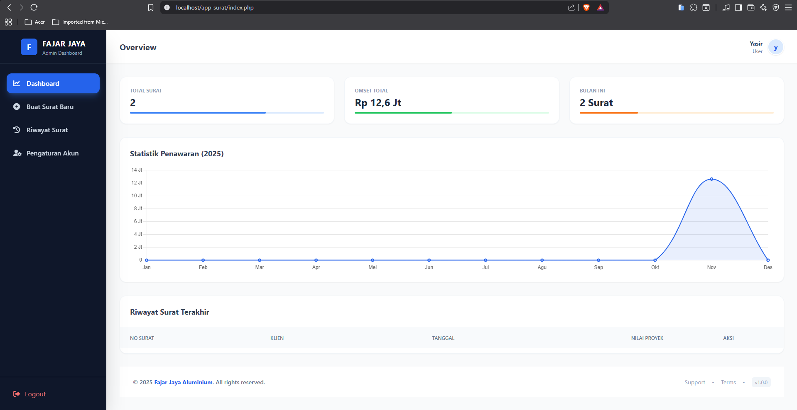
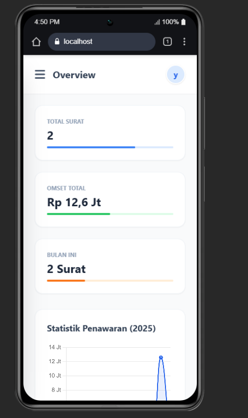
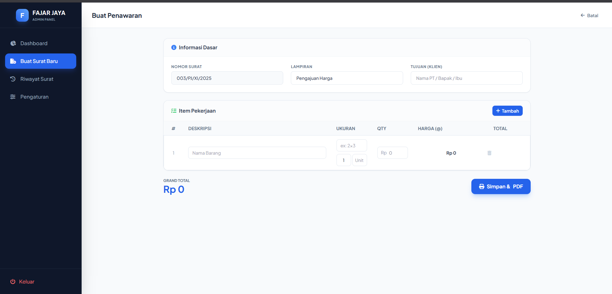
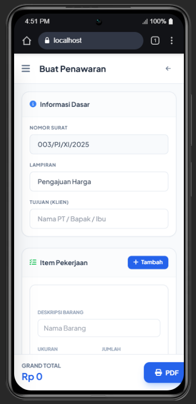
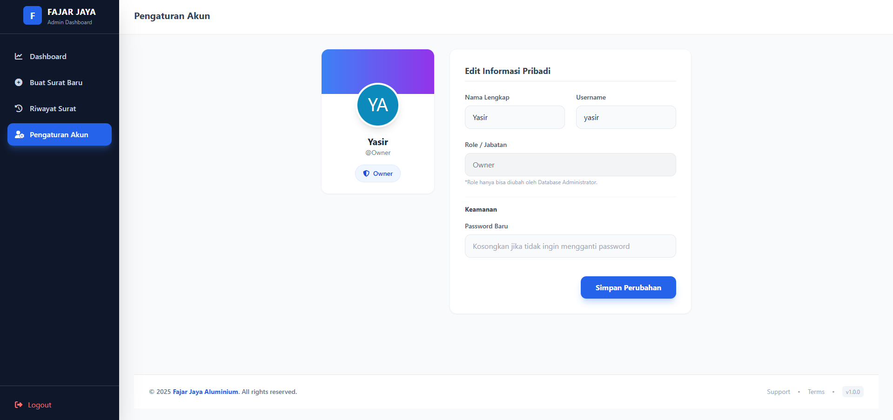
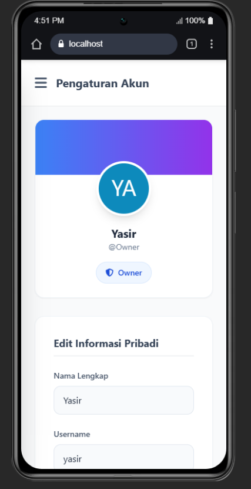

<div align="center">

  

# 📑 Sistem Penawaran Harga (Quotation App)

**Aplikasi Manajemen Surat Penawaran Digital berbasis Web**

  <p>
    <a href="#-fitur-unggulan">Fitur</a> •
    <a href="#-teknologi">Teknologi</a> •
    <a href="#-instalasi">Instalasi</a> •
  </p>
</div>

---

## 📖 Tentang Aplikasi

Project ini adalah **Sistem Informasi Penawaran Harga** yang dibangun untuk mempermudah operasional bisnis (Studi kasus: _Fajar Jaya Aluminium_). Aplikasi ini menggantikan proses pembuatan surat manual (Word/Excel) menjadi sistem otomatis yang terintegrasi dengan database, kalkulasi harga otomatis, dan _PDF generation_.

Cocok digunakan untuk bisnis UMKM, kontraktor, atau jasa yang membutuhkan surat penawaran resmi dengan format standar.

## 📸 Screenshots Tampilan Aplikasi

#### 🖥️ Desktop vs 📱 Mobile

| Dashboard (Desktop)                           | Dashboard (Mobile)                          |
| --------------------------------------------- | ------------------------------------------- |
|  |  |
| _Tampilan Statistik & Tabel_                  | _Dashboard versi Mobile_                    |

---

### 📝 Halaman Create (Tambah Surat)

| Create (Desktop)                        | Create (Mobile)                       |
| --------------------------------------- | ------------------------------------- |
|  |  |
| _Form Input Data Penawaran_             | _Form Input versi Mobile_             |

---

### 👤 Halaman Akun (Profile / User)

| Account (Desktop)                         | Account (Mobile)                        |
| ----------------------------------------- | --------------------------------------- |
|  |  |
| _Manajemen Akun & Password_               | _Profil & Pengaturan versi Mobile_      |

## 🌟 Fitur Unggulan

### 💼 Manajemen Surat

- **CRUD Penawaran:** Buat, Baca, Edit, dan Hapus surat dengan mudah.
- **Auto Numbering:** Format nomor surat otomatis (Contoh: `001/PJ/XI/2025`) yang mereset sesuai logika bisnis.
- **PDF Generator:** Cetak surat langsung ke PDF dengan layout presisi (Logo, TTD, Tabel Harga) menggunakan **Dompdf**.

### 💻 User Interface (UI/UX)

- **Modern Dashboard:** Statistik real-time (Total Surat, Omset Bulanan) dengan visualisasi **Chart.js**.
- **Responsive Design:** Tampilan tabel otomatis berubah menjadi _Card Layout_ saat dibuka di Smartphone (Mobile-First).
- **Interactive Feedback:** Notifikasi aksi (Simpan/Hapus) menggunakan **SweetAlert2**.

### 🔐 Keamanan & Sistem

- **Multi-User:** Sistem Login/Logout aman.
- **Secure Password:** Hashing password menggunakan algoritma `Bcrypt`.

## 🛠️ Teknologi

Aplikasi ini dibangun menggunakan _Tech Stack_ yang ringan dan mudah dikembangkan:
  

- **Backend:** PHP Native
- **Database:** MySQL / MariaDB
- **Frontend:** HTML5, Tailwind CSS (via CDN)
- **Libraries Pihak Ketiga:**
  - 📄 `dompdf/dompdf`: Engine konversi HTML ke PDF.
  - 📊 `chart.js`: Library untuk grafik statistik.
  - 🔔 `sweetalert2`: Popup notifikasi modern.
  - 🎨 `fontawesome`: Ikon vektor.

## 📦 Instalasi

Ikuti langkah berikut untuk menjalankan project di komputer lokal (Localhost):

**1. Clone Repository**

```bash
git clone https://github.com/itszarmaull/sistem-informasi-invoice-sederhana
cd sistem-informasi-invoice-sederhana
```

**2. Install Dependencies Pastikan Anda sudah menginstall Composer, lalu jalankan:**

```bash
composer install
```

**\*3. Setup Database \***

```bash
1) Buka PHPMyAdmin.
2) Buat database baru dengan nama db_surat_alumunium (atau sesuaikan).
3) Import file database.sql yang tersedia di folder root project.
```

**4. Konfigurasi Koneksi**

```bash
$host = 'localhost';
$user = 'root';      // Username database lokal
$pass = '';          // Password database lokal
$db   = 'db_surat_alumunium';
```

**5.Jalankan Buka browser dan akses: http://localhost/sistem-informasi-invoice-sederhana**
👤 Akun Demo
| username| password|
|--------|---------|
| admin A | admin123 |

<div align="center"> <small>Dibuat dengan ❤️ dan ☕ Kopi.</small> </div>
